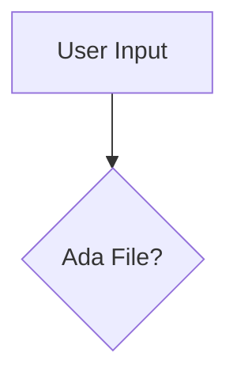

# 💰 MoneyTrack - Sistem Informasi Keuangan & ERP Mini

[](https://laravel.com)
[](https://tailwindcss.com)
[](LICENSE)

**MoneyTrack** adalah sebuah aplikasi ERP Mini (Enterprise Resource Planning) berbasis web yang dirancang khusus untuk membantu pencatatan, analisis, dan pengelolaan keuangan secara real-time. Aplikasi ini dibangun menggunakan framework **Laravel** dengan fokus pada keamanan data, agregasi laporan keuangan yang dinamis, serta kemudahan pencetakan laporan.

---

## 🌟 Fitur Utama (Key Features)

- 🔒 **Sistem Autentikasi Manual:** Registrasi enkripsi (`Bcrypt`), Login dengan verifikasi sesi aman, pencegahan *Session Fixation*, dan proteksi rute halaman menggunakan Middleware Laravel.
- 📊 **Dasbor Ringkasan Interaktif:** Metrik visual untuk total saldo aktif, pemasukan, pengeluaran, serta riwayat transaksi terbaru yang dilengkapi modal entry transaksi modern.
- 📈 **Agregasi Data & Analisis Keuangan:** Kalkulasi statistik otomatis menggunakan query Eloquent (`sum`, `avg`, `max`, `count`) untuk menghitung pengeluaran berdasarkan kategori dalam bentuk persentase diagram batang visual.
- 🖨️ **Cetak Laporan PDF Bulanan:** Pembuatan berkas PDF laporan keuangan secara otomatis berdasarkan filter bulan dan tahun menggunakan library **Laravel DomPDF**.
- 📂 **Proteksi File Bukti Nota (Private Storage):** File bukti transaksi/nota disimpan secara aman di dalam server private (tidak bisa diakses langsung via URL). Gambar nota hanya dapat dimuat melalui rute khusus yang dilindungi autentikasi pengguna.
- 🗂️ **Manajemen Kategori Kustom:** Penambahan kategori transaksi (Pemasukan/Pengeluaran) secara dinamis lengkap dengan retensi data *flash session* dan validasi nama unik.

---

## 💻 Teknologi & Library (Tech Stack)

- **Framework Utama:** Laravel v12.x & PHP >= 8.2
- **Desain Antarmuka:** HTML5, TailwindCSS (Vanilla CSS kustom & Glassmorphism UI)
- **Database:** MySQL / SQLite
- **Library Eksternal:** `barryvdh/laravel-dompdf` (Perender PDF dokumen)

---

## 🚀 Petunjuk Instalasi (Installation Guide)

Ikuti langkah-langkah di bawah ini untuk menjalankan proyek MoneyTrack di komputer lokal Anda:

### 1. Prasyarat (Prerequisites)
Pastikan komputer Anda sudah terinstal:
- PHP >= 8.2
- Composer
- Node.js & NPM
- Database Server (seperti XAMPP/MySQL)

### 2. Kloning Repositori
```bash
git clone https://github.com/username/mini-ERP.git
cd mini-ERP
```

### 3. Instalasi Dependensi PHP & JavaScript
```bash
# Instal dependensi backend Laravel
composer install

# Instal dependensi frontend Tailwind/Vite
npm install
```

### 4. Konfigurasi Environment File
Salin file konfigurasi environment `.env.example` menjadi `.env`:
```bash
cp .env.example .env
```
Buka file `.env` yang baru dibuat dan sesuaikan konfigurasi database Anda:
```env
DB_CONNECTION=mysql
DB_HOST=127.0.0.1
DB_PORT=3306
DB_DATABASE=db_moneytrack
DB_USERNAME=root
DB_PASSWORD=
```

### 5. Generate Application Key
```bash
php artisan key:generate
```

### 6. Jalankan Migrasi Database
Buat database baru dengan nama `db_moneytrack` di phpMyAdmin, kemudian jalankan perintah migrasi tabel:
```bash
php artisan migrate
```

### 7. Jalankan Server Lokal
Nyalakan server lokal Laravel dan compiler aset frontend:
```bash
# Di terminal 1 (Jalankan server PHP)
php artisan serve

# Di terminal 2 (Jalankan compiler Vite)
npm run dev
```
Akses aplikasi melalui browser Anda di alamat: [http://127.0.0.1:8000](http://127.0.0.1:8000)

---

## 🔒 Skema Keamanan File (Private Storage)

Aplikasi ini menggunakan metode **Private Storage** untuk menjaga kerahasiaan dokumen bukti nota belanja perusahaan:
1. File fisik diunggah dan disimpan ke dalam direktori rahasia: `/storage/app/private/receipts/`.
2. Browser luar tidak diizinkan mengakses direktori ini secara langsung (Akses langsung akan menghasilkan error *404 Not Found*).
3. Akses file dilakukan secara aman melewati kontrol rute terproteksi: `/transactions/{transaction}/receipt` yang memverifikasi sesi aktif pengguna sebelum menampilkan gambar nota menggunakan method `response()->file()`.

---
## Diagram


---

## 📄 Lisensi
Proyek ini dilisensikan di bawah **MIT License** - Lihat file [LICENSE](LICENSE) untuk detail lebih lanjut.
